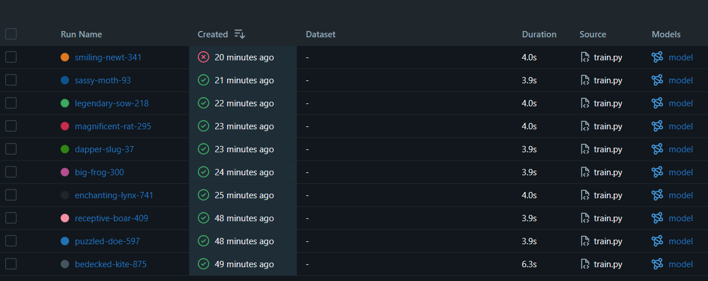
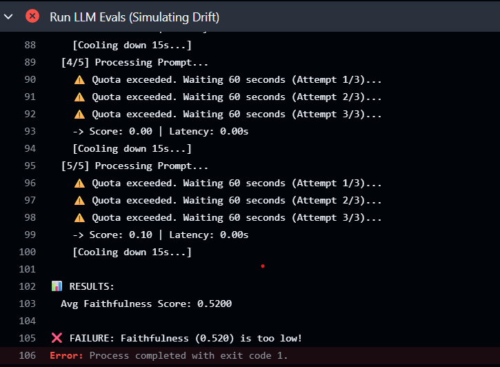

⚙️ LLMOps: Automated Observability & Evaluation Pipeline

Overview

This project establishes a production-grade LLMOps (Large Language Model Operations) pipeline designed to monitor, evaluate, and deploy Generative AI applications reliably.

Unlike traditional MLOps which tracks numerical error (RMSE/Accuracy), this pipeline implements LLM-as-a-Judge. It uses a second LLM (Google Gemini) to grade the responses of the primary model for Faithfulness and Safety. The system enforces strict Quality Gates in a CI/CD workflow, automatically blocking any deployment that shows signs of increased hallucinations or latency spikes.

✨ Key Features

LLM-as-a-Judge: Implements an automated evaluation loop where a "Judge" LLM scores responses (0.0 - 1.0) on faithfulness and factual accuracy.

Automated Quality Gates: A GitHub Actions workflow that fails the build if the average Faithfulness Score drops below 0.6, preventing regression.

Observability Dashboard: Tracks Token Usage, Latency (ms), and Quality Scores across experiments using MLflow.

Drift Detection: Includes a "Drift Mode" simulation (injecting adversarial prompts) to verify the pipeline's ability to catch and block degraded performance.

🛠️ Tech Stack

Core Logic: Python 3.10+

LLM Provider: Google Gemini API (gemini-1.5-flash)

Tracking: MLflow (Experiment Tracking & Artifact Logging)

Automation: GitHub Actions (CI/CD)

Metrics: Faithfulness Score, Token Count, Latency

⚙️ Pipeline Architecture

Trigger: Developer pushes code to the repository.

Generation: The pipeline sends a test set of medical questions to the LLM.

Evaluation: A separate "Judge" LLM evaluates the answers for accuracy.

Logging: Real-time metrics (Latency, Tokens, Score) are logged to MLflow.

Gatekeeper:

✅ Pass: If Faithfulness > 0.6, the pipeline succeeds.

❌ Fail: If Faithfulness < 0.6, the pipeline crashes (Red X), alerting the team.

📸 Evidence of Automation

MLflow Dashboard (Tracking)                                          GitHub Actions (Quality Gate)                                          (Comparing experiments)                                               (Blocking a bad model)                                                                         

Right: The pipeline correctly identifying "Drifted Data" and failing the build (Red X), preventing a bad deployment.

🚀 How to Run Locally

1. Prerequisites

Python 3.10+
A Google Gemini API Key

2. Install Dependencies
pip install -r requirements.txt

3. Run a Normal Experiment
python llm_eval.py
Result: ✅ SUCCESS: Model passed quality gate.3. Simulate Data Drift (Test the Gate)Bashpython train.py 0.5 0.5 drift

4. Simulate Data Drift (Test the Gate)
python llm_eval.py drift
Result: ❌ FAILURE: Model RMSE (0.71) is higher than threshold!