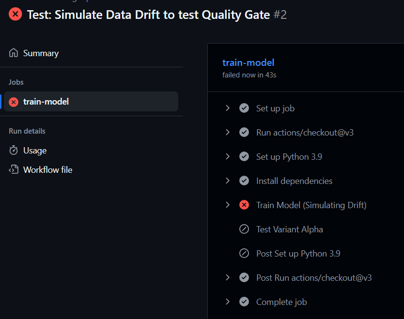

🚀 Automated MLOps: CI/CD Pipeline with Drift Detection

Overview
Automated MLOps is an end-to-end Machine Learning pipeline that automates the lifecycle of model training, evaluation, and deployment.
Unlike standard data science projects where models are trained manually in notebooks, this project implements CI/CD (Continuous Integration/Continuous Deployment). Every time code is pushed to GitHub, the system automatically triggers a training run, logs metrics, and strictly enforces Quality Gates. If the model accuracy drops (e.g., due to Data Drift), the pipeline automatically blocks deployment to protect production systems.

✨ Key Features

Automated CI/CD: GitHub Actions triggers model training on every commit.
Experiment Tracking: Uses MLflow to log parameters (alpha, l1_ratio) and metrics (RMSE, R2) for every run.
Quality Gates: A strict "Guardrail" system that fails the build if the model's RMSE exceeds a defined threshold (0.6).
Data Drift Simulation: Includes a "Drift Mode" to simulate real-world data corruption and verify the pipeline's ability to catch it.

🛠️ Tech Stack

Core: Python 3.9, Scikit-Learn, Pandas
Tracking: MLflow (Metric & Artifact Logging)
Automation: GitHub Actions (YAML Workflows)
Environment: Ubuntu Cloud Runners

⚙️ Pipeline Architecture

Code Push: Developer pushes changes to main.
Environment Setup: GitHub Action installs dependencies from requirements.txt.
Training & Logging: The script trains the ElasticNet model and logs results to MLflow.
Quality Check: The system compares the new model's RMSE against the threshold.

✅ Pass: Artifacts are uploaded.
❌ Fail: Pipeline crashes, alerting the team via email/dashboard.

📸 Evidence of Automation

MLflow Dashboard (Tracking)                                          GitHub Actions (Quality Gate)                                          (Comparing experiments)                                               (Blocking a bad model)                                                                         

Right: The pipeline correctly identifying "Drifted Data" and failing the build (Red X), preventing a bad deployment.

🚀 How to Run Locally

1. Install Dependencies
pip install -r requirements.txt

2. Run a Normal Experiment
python train.py 0.5 0.5
Result: ✅ SUCCESS: Model passed quality gate.3. Simulate Data Drift (Test the Gate)Bashpython train.py 0.5 0.5 drift

3. Simulate Data Drift (Test the Gate)
python train.py 0.5 0.5 drift
Result: ❌ FAILURE: Model RMSE (0.71) is higher than threshold!